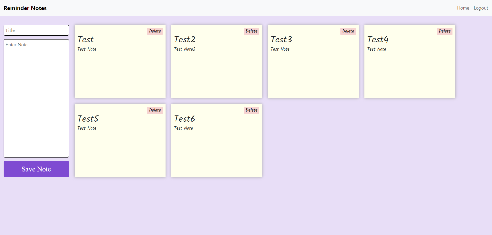

# Reminder Notes

## About

This application was created and designed to help organize sticky note reminders we all user on and around our computers. This app helps organize notes and make them so they cannot get lost or accidentally ruin should coffee spill on our desk! All notes are kept in one place, stored safely and with the use of a login these notes are stored privately. Sign up today!

## Navigation

- Click "Sign Up!" if you do not already have credentials established to set up your account.
- If you already have a login established then just click "Login".
- Click on "See My Notes!"
- Enter text into "Title" as well as for the "Enter Note".
- Click "Save Note".
- To edit a note, click on the note and update the note in the editor.
- To delete a note, just click the "Delete" button.

## Notes Page

## Technology
