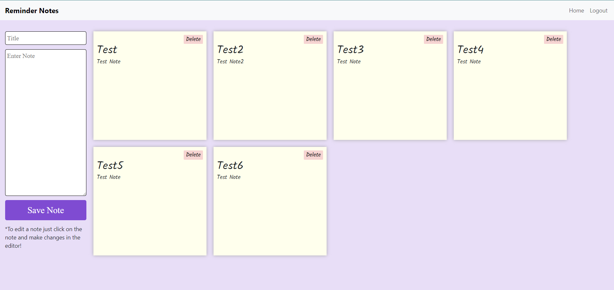

# Reminder Notes

## About

This application was created and designed to help organize sticky note reminders we all user on and around our computers. This app helps organize notes and make them so they cannot get lost or accidentally ruin should coffee spill on our desk! All notes are kept in one place, stored safely and with the use of a login these notes are stored privately. Sign up today!

## Navigation

- Click "Sign Up!" if you do not already have credentials established to set up your account.
- If you already have a login established then just click "Login".
- Click on "See My Notes!"
- Enter text into "Title" as well as for the "Enter Note".
- Click "Save Note".
- To edit a note, click on the note and update the note in the editor.
- To delete a note, just click the "Delete" button.

## Notes Page

## Technology

- HTML / CSS (JSX)
- JavaScript
- Node.js
- Express.js
- React Vite
- React Bootstrap
- Google Fonts
- Heroku

## Author

Angi Adema
Email: angi.adema@gmail.com
LinkedIn: https://www.linkedin.com/in/angi-adema-169b6925b/

## Repo Link

GitHub: https://github.com/Angi-Adema/reactvite-reminder-note-app

## Deploy Locally

1. Clone the file from GitHub.
2. Run "npm i" to install packages.
3. Run "npm run dev" to start front and back servers.
4. Visit localhost:5173.

## Deployed Site

https://reminder-notes-b55040377751.herokuapp.com/

## Future Development

- Build a profile page so the user can login, update their password and/or email as well as the ability to delete the user account. Includes confirmation on the navbar of current user logged in.
- During user sign up, add a password confirmation field to be sure the passwords are identical. Also, link Google so the user can opt to using their Google login to create an account.
- Would like to make it so that different color sticky notes can be used to color code different tasks or reminders.
- Possibly add a calendar to the functionality to manage deadlines for some of the reminder notes.
